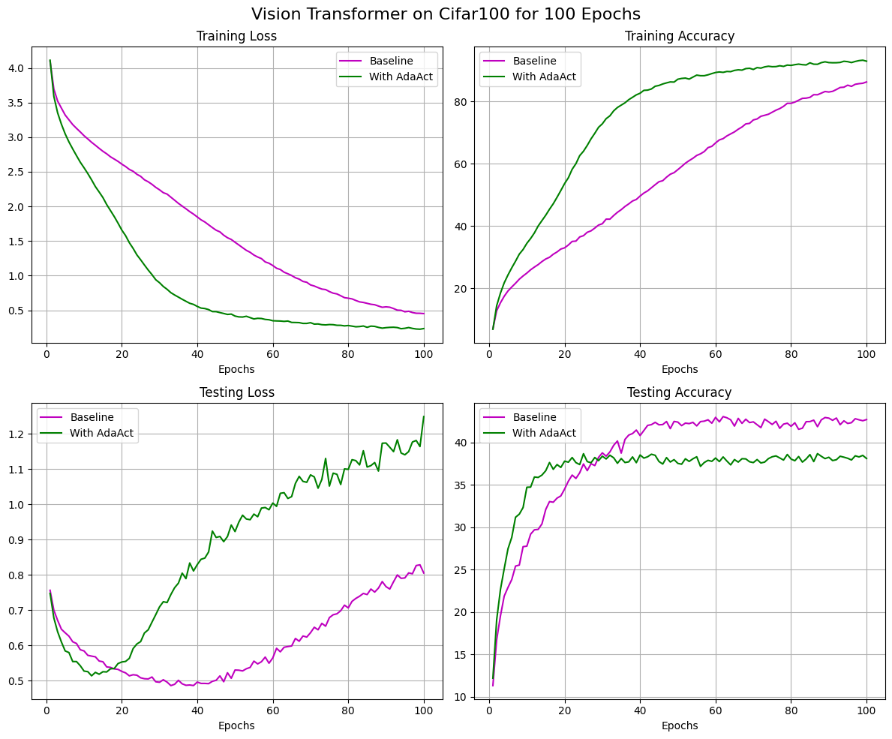

# AdaAct
An adaptive activation function that combines multiple activation functions with data-driven weights, enhancing flexibility and generalization across tasks. Includes regularization for sparsity, choosing only the most relevant activations. 

## Results on ResNet18

### CIFAR10

### CIFAR100

## Results on Vision Transformer

### CIFAR10

### CIFAR100

